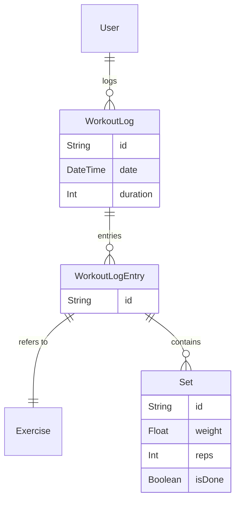

# Design: Refined Logging Schema

## Context
Our current schema has a flat `WorkoutLog` model with a placeholder for "details". To support a professional "checkmark-to-save" experience and historical strength tracking, we need to normalize this into three levels: Log -> Entry -> Set.

## Goals / Non-Goals

**Goals:**
- Define a relational structure that tracks individual sets.
- Ensure every set has an `isDone` boolean.
- Link sets to specific exercises within a workout session.

**Non-Goals:**
- Implementing the UI (this change is strictly for the Data Schema).
- Handling "Supersets" logic (will be handled as sequential entries for now).

## Decisions

### Decision 1: Relational over JSON
We are using a traditional Relational approach with `Set` and `WorkoutLogEntry` models.
- **Rationale**: SQL aggregations (MAX, AVG) on sets are much faster than parsing JSON at scale.
- **Trade-off**: More tables and more complex joins for a single "Log" view.

### Decision 2: Cascading Deletes
When a `WorkoutLog` is deleted, all its `WorkoutLogEntry` records and `Set` records MUST be deleted (Cascade).
- **Rationale**: We don't want "orphaned" sets floating around in the DB without a parent log.

### Decision 3: Float for Weight
We will use `Float` for the `weight` field in the `Set` model.
- **Rationale**: To support kgs/lbs and fractional weights (e.g. 2.5kg plates).

## Data Model (Prisma)

## Risks / Trade-offs
- **Risk**: A high volume of sets might make the `dev.db` file grow faster.
- **Mitigation**: SQLite handles millions of rows efficiently; this is unlikely to be an issue for a personal tracker app in the near future.
