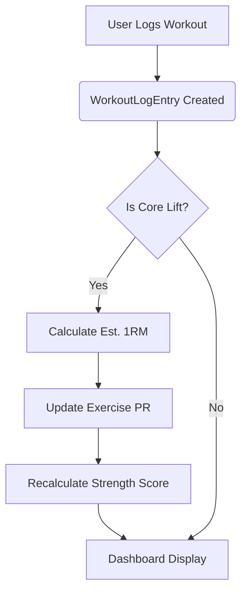

# Proposal - Strength Score & Analytics Engine

## Summary
Transform the existing hardcoded "Strength Score" into a dynamic, data-driven metric that reflects a user's progress across key compound movements. This involves defining "Core Lifts," implementing 1RM (One Rep Max) estimation logic, and providing a longitudinal view of performance.

## Design Decisions

### 1. The Core Lifts
To calculate a representative "Strength Score," we will track the estimated 1RM for the following primary compound movements:
- **Back Squat** (Lower Body Push)
- **Deadlift** (Lower Body Pull)
- **Bench Press** (Upper Body Push - Horizontal)
- **Overhead Press** (Upper Body Push - Vertical)

### 2. The 1RM Formula
We will use the **Brzycki Formula** for its reliability in the 1-10 rep range:
`1RM = Weight × (36 / (37 - Reps))`

### 3. Strength Score Calculation
- **Absolute Score**: The sum of the current estimated 1RM for the 4 Core Lifts.
- **Relative Score (Future)**: Absolute Score / Bodyweight. (Requires Bodyweight tracking implementation).

### 4. Data Refresh Strategy
- **On-Demand**: Aggregated stats are calculated when the Dashboard is loaded.
- **Caching**: Recent PRs and scores can be cached in the user's session or a dedicated `UserStats` table to avoid heavy DB joins on every load.

## Proposed Metadata Changes
To support the "Core Lifts" identification without hardcoding strings, we should add a `isCoreLift` boolean or a `liftType` enum to the `Exercise` model.

## Visual Flow

## Feedback Needed
- Should we include **Weighted Pull-ups** or **Rows** to better represent "Pull" strength in the core score?
- Do you prefer a simple "Total Weight" score or a normalized "Points" system (like Sinclar or Wilks)?
